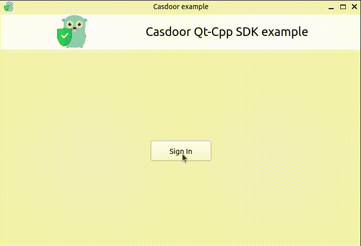
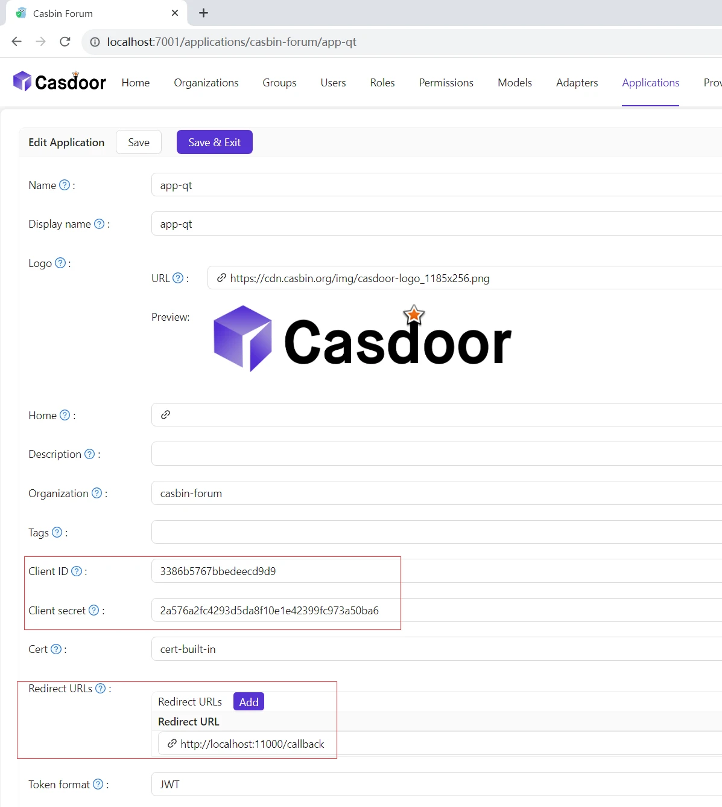
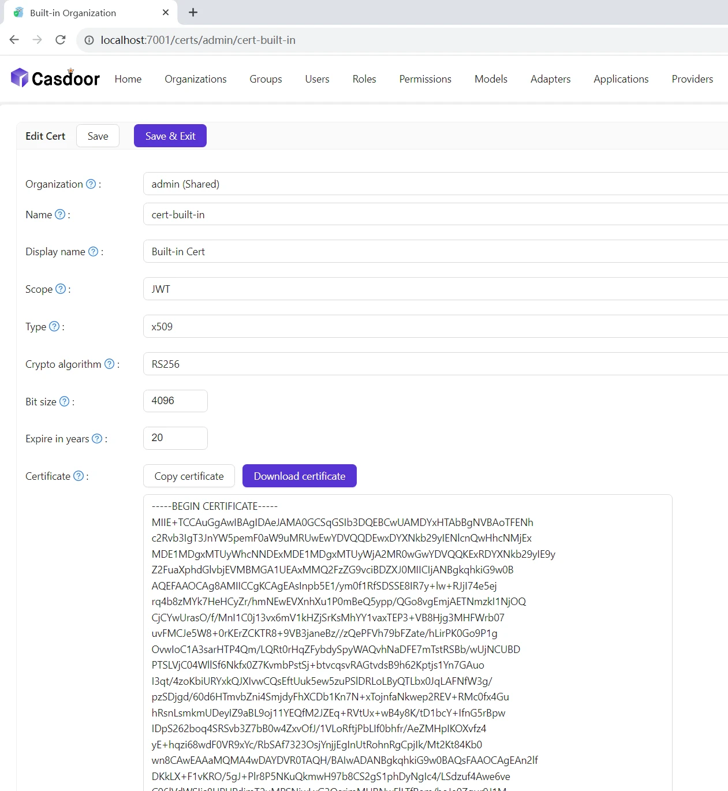

<h1 align="center" style="border-bottom: none;">📦⚡️casdoor cpp qt example</h1>
<h3 align="center">A Qt desktop app that signs in with Casdoor, using <a href="https://github.com/casdoor/casdoor-cpp-sdk">casdoor-cpp-sdk</a></h3>

## Demo



Clicking **Sign In** opens the Casdoor sign-in page in an embedded browser (Qt WebEngine). After signing in, Casdoor redirects to the redirect URI with an authorization code. The app catches that redirect inside the embedded browser, exchanges the code for a token with the SDK, verifies the token and shows the user.

## Requirements

- Qt 6 with the Qt WebEngine module (on Windows, Qt WebEngine needs the MSVC build of Qt)
- CMake 3.16+ and a C++17 compiler
- OpenSSL 1.1.1 or 3.x
- A Casdoor server

casdoor-cpp-sdk is downloaded by CMake when you configure the project, so it doesn't need to be installed.

## Configure Casdoor

1. In Casdoor, create an application (or use an existing one) and add `http://localhost:8080/callback` to its **Redirect URLs**. Nothing needs to listen on that port.
2. Copy the application's **Client ID** and **Client secret**.

   

3. On the Certs page, copy the public **Certificate** of the cert the application uses.

   

4. Put these values in [config.h](config.h):

   ```cpp
   inline constexpr const char* kCasdoorEndpoint = "http://localhost:8000";
   inline constexpr const char* kClientId = "<client ID>";
   inline constexpr const char* kClientSecret = "<client secret>";
   inline constexpr const char* kOrganizationName = "<organization>";
   inline constexpr const char* kApplicationName = "<application>";
   inline constexpr const char* kRedirectUri = "http://localhost:8080/callback";
   inline constexpr const char* kCertificate = R"(-----BEGIN CERTIFICATE-----
   ...
   -----END CERTIFICATE-----)";
   ```

## Build and run

Open `CMakeLists.txt` in Qt Creator and run it, or from the command line:

```bash
cmake -S . -B build -DCMAKE_PREFIX_PATH=/path/to/Qt/6.x/<compiler>
cmake --build build
./build/casdoor-cpp-qt-example
```

On Windows, if CMake can't find OpenSSL, add `-DOPENSSL_ROOT_DIR="C:/Program Files/OpenSSL-Win64"`.

To build against a local checkout of casdoor-cpp-sdk instead of the one on GitHub, add `-DFETCHCONTENT_SOURCE_DIR_CASDOOR=/path/to/casdoor-cpp-sdk`.

On Ubuntu, the dependencies can be installed with:

```bash
sudo apt install cmake g++ libssl-dev qt6-base-dev qt6-webengine-dev libgl-dev
```

## How it works

- [mainwindow.cpp](mainwindow.cpp) builds the sign-in URL with `casdoor::Client::GetSigninUrl` and a random `state`.
- `CallbackPage::acceptNavigationRequest` stops the embedded browser when it's about to load the redirect URI and passes the URL to the window.
- The window checks `state`, then calls `GetOAuthToken(code)` and `ParseJwtToken(token.access_token)`, which verifies the token's signature with the certificate.
- **Sign Out** deletes the embedded browser's cookies, so the next sign-in asks for the password again.
